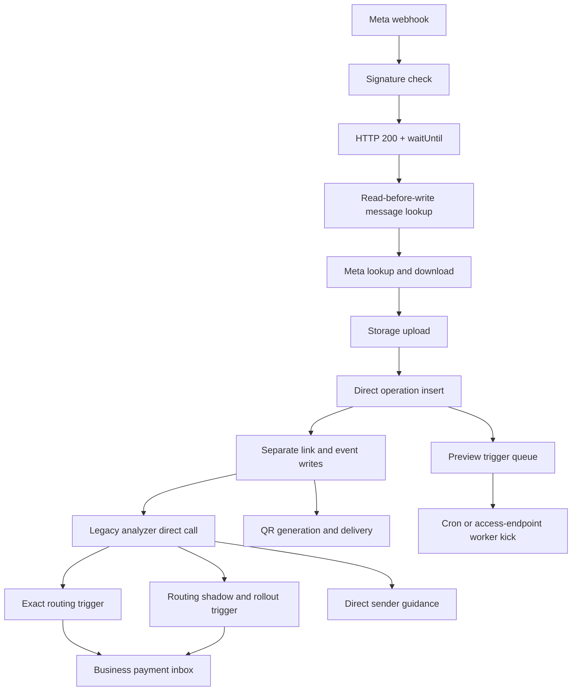
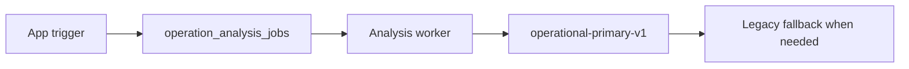

# SANAD operation pipeline production audit — 2026-08-06

## Audit scope and sources

This audit compared:

- the six SANAD OS Notion references requested for this phase;
- GitHub `mbhkm25/S`, `main@b4af81e6370357fd4798dd6f747767f072bf8888`;
- deployed Supabase Edge Function sources and versions;
- live PostgreSQL tables, functions, triggers, indexes, grants, cron jobs, migration history, logs, and pipeline telemetry in `hudbzlgclghlhazlduas`.

GitHub is treated as the code source of truth. Live production data and schema are treated as the runtime truth. Differences are recorded rather than reconciled by assumption.

## Current production flow

The app analysis gateway is a separate path:

There is no live `operations` trigger that connects WhatsApp-created operations to `operation_analysis_jobs`.

## Confirmed production facts

### Source and deployment parity

- `origin/main` and local `main` both resolved to the PR #169 squash commit.
- The deployed WhatsApp intake, legacy analyzer, primary analyzer, analysis worker, shadow analyzer, preview worker, and transactional worker matched tracked source. Two deployed bundles differed only in formatting/minification during manual semantic comparison.
- The deployed database contains `private.enqueue_business_review_whatsapp_from_notification` and its trigger, but that function is not represented by an equivalent tracked migration in current `main`.
- Supabase migration history versions/names diverge materially from filenames in `main`. In particular, the live analysis queue objects exist while `add_operation_analysis_queue` is absent from recorded migration history under that name/version.
- `main` contained four temporary/one-shot workflows. Two realtime patchers
  were invalid YAML and pushed generated source to a feature branch;
  `operation-business-link-portal-implementation.yml` used
  `pull_request_target` with contents write and referenced a missing script;
  `one-shot-deploy-profile-completion.yml` duplicated the guarded production
  deployment. This change removes all four and keeps pull-request workflows
  validation-only.

### Intake and idempotency

- Intake uses `findExisting()` against `storage_metadata->>'meta_message_id'` before upload.
- No unique index protects the WhatsApp message ID.
- Storage paths include `Date.now()`, so concurrent duplicates can upload different objects before either operation becomes visible.
- Operation, uploader link, and `file_uploaded` event are separate HTTP requests.
- The webhook returns HTTP 200 before intake work completes and relies on `EdgeRuntime.waitUntil` for the full media, storage, operation, analysis, QR, and guidance flow.
- Historical data contained 103 non-null message IDs, all distinct. This is observed behavior, not an enforced invariant.
- Intake directly calls `register_whatsapp_inbound` before supported-media
  idempotency and directly awaits `sanad-v3-whatsapp-onboarding` after QR.
  Production already has the enabled
  `trg_capture_whatsapp_operation_contact` operation trigger, its canonical
  contact-capture function, immediate dispatch, and the active
  `sanad-whatsapp-onboarding-dispatch` cron backstop. The direct Intake calls
  are therefore redundant execution sources and synchronous waits.

### Analysis

- WhatsApp intake defaults to direct `sanad-v3-analyze-operation` execution.
- The live `operation_analysis_jobs` table contained zero rows in every state.
- No operation trigger enqueues analysis jobs.
- The analysis worker was nevertheless called by cron every minute and returned quickly with no work.
- All 155 current operations lacked the new top-level `raw_ai_json.engine` marker at the snapshot; 98 WhatsApp operations were completed by the legacy `gemini-2.5-flash` path. The last operation creation preceded the PR #169 merge, so this dataset is not a post-merge production proof of the new path.

### Preview

- Preview jobs: 148 completed, 5 pending, 2 failed.
- The five pending jobs included stale-processing recoveries and prior rendering errors.
- The access endpoint may synchronously wait up to 28 seconds for the preview worker and is therefore an additional execution source.
- The queue keeps only `pending/processing/completed/failed`, claims one job, and does not retain reliable queue-wait/execution timestamps after completion.
- By MIME: JPEG 103 total with 2 terminal failures; PDF 41 total with no terminal failure; WebP 11 total with no terminal failure. This does not yet justify separate workers.

### Routing and payment inbox

- `operations_exact_identifier_routing` writes to the inbox after completed analysis.
- `trg_run_operation_routing_shadow_v2` creates a routing run; `trg_evaluate_financial_routing_rollout` may also write to the inbox.
- The inbox unique key is `(business_id, operation_id)`, so it prevents same-business duplicates but not two automatic businesses for one operation.
- No current operation had inbox rows for more than one business, but two automatic writer paths remain active.
- Routing shadow had 151 runs for 146 operations; two operations had multiple runs and one had five.
- Current inbox rows were produced by exact/canary/live, operational-match, and manual sources.

### Notifications

- The transactional outbox contained zero rows; all ten rules were disabled.
- Its worker requires a platform-admin session even though queue claims themselves require service role, so it is not an automatic queue worker.
- Sender guidance uses a separate delivery table and direct Meta send inside intake.
- All nine guidance records were marked failed. Eight failed after Meta submission because inserting `whatsapp_sender_guidance_sent` violated the operation-event type constraint; one failed due to an invalid button-title length.
- The post-send telemetry failure creates a duplicate risk because a sent message is left in a retryable-looking state.

### Cron and dispatch

- Analysis dispatch ran 1,316 times in the preceding 24-hour window despite an empty queue.
- Preview dispatch ran 1,440 times in the same period.
- Dispatch functions send worker HTTP requests unconditionally and have no shared dispatch lease.
- `pg_cron` is therefore the primary dispatch source today rather than a recovery backstop.

### Security and access nuance

- Several private tables have RLS disabled, but direct `anon`, `authenticated`, and `service_role` table grants were absent for the audited token/preview tables. This is defense-in-depth debt, not evidence of direct Data API exposure.
- Production operation metadata confirms signature verification is not
  configured: 34 recent WhatsApp operations recorded
  `meta_signature_mode=not_configured`, while 34 older records were
  `not_recorded`. The tracked intake also defaulted
  `REQUIRE_META_SIGNATURE` to false. Production signature enforcement is
  therefore a confirmed release blocker, not an unknown.

## Baseline latency from live spans

| Pipeline stage | Samples | P50 | P95 | P99 | Recorded failures |
| --- | ---: | ---: | ---: | ---: | ---: |
| Meta lookup/download | 33 | 2.431s | 3.848s | 4.527s | 0 |
| Storage upload | 33 | 0.842s | 1.392s | 1.531s | 0 |
| Operation create | 33 | 0.334s | 0.579s | 0.629s | 0 |
| QR delivery | 33 | 2.565s | 2.986s | 4.245s | 0 |
| Legacy analysis inside intake | 33 | 19.939s | 40.056s | 58.215s | 4 |
| Full intake background task | 33 | 25.201s | 44.808s | 65.900s | 4 |

These are background-task spans, not Meta's observed HTTP response latency, because HTTP 200 is returned before the task completes.

## Confirmed defects and risks

1. **Critical — split analysis path:** WhatsApp does not use the new queue/primary engine while the app gateway does.
2. **Critical — non-transactional original finalization:** operation, event, relationship, and jobs cannot commit or roll back together.
3. **High — unenforced webhook idempotency:** concurrent Meta retries can create duplicate storage objects and operations.
4. **High — post-send false failure:** telemetry can mark a delivered guidance message failed and enable duplicate delivery.
5. **High — two automatic inbox writers:** exact routing and rollout routing compete without a one-operation projection invariant.
6. **High — production deployment provenance:** some workflows deploy from PRs or a feature branch.
7. **Medium — cron dispatch storm:** thousands of empty worker calls occur daily.
8. **Medium — preview access execution coupling:** a read endpoint can block on worker execution.
9. **Medium — migration-history drift:** production cannot be reconstructed confidently from current migration filenames/history alone.
10. **Medium — incomplete telemetry:** queue wait and execution are not consistently preserved as separate measurements.
11. **High — webhook authenticity not enforced:** recent production operations
    explicitly record `meta_signature_mode=not_configured`.
12. **Medium — duplicate contact/onboarding ownership:** supported-media Intake
    performs direct pre-claim/post-QR work already owned by the operation trigger
    and onboarding queue.

## Statements not supported by current runtime evidence

- “The database creates an analysis job for every WhatsApp operation” is false in the audited live schema.
- “WhatsApp currently double-analyzes every operation” is not proven. The dangerous architecture exists in source, but the live queue is not connected to WhatsApp creation. The current confirmed failure is channel split; adding a queue trigger without removing the direct call would then create the predicted double analysis.
- “The new primary engine has been proven on post-merge real WhatsApp traffic” is not established by the audited dataset.

## Required correction boundary

The implementation must follow [ADR-001](../architecture/ADR-001-instant-intake-event-driven-pipeline.md). No production mutation is authorized from this audit alone. Migrations and Edge Function changes must first be tracked, tested on the implementation branch, reviewed through a PR, merged, and deployed from `main`.
